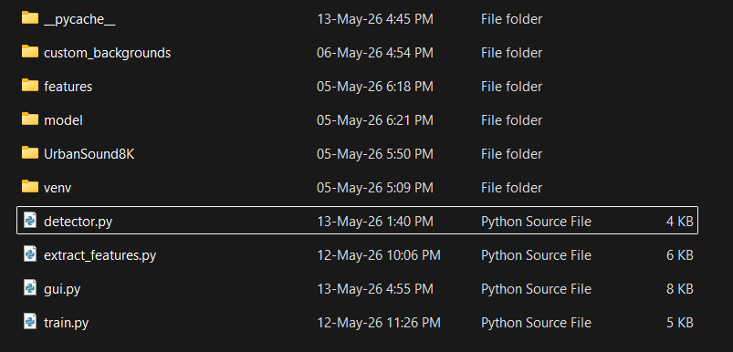

# 🔊 Sound Detector (Gunshot & Siren)

A real-time deep learning audio classifier that detects gunshots and sirens. This project uses [YAMNet](https://tfhub.dev/google/yamnet/1) to extract audio embeddings and a custom Keras Dense neural network to classify the sounds. It includes a live PyQt5 graphical interface for real-time monitoring.

## 🛠️ Prerequisites

Make sure you have Python 3.8+ installed. You will also need to download the datasets before running the extraction and training scripts.

### 1. Setting up the Virtual Environment
It's highly recommended to use a virtual environment to manage dependencies. Open your terminal in the project folder and run:

**Windows:**
```bash
python -m venv venv
venv\Scripts\activate
```

**macOS/Linux:**
```bash
python3 -m venv venv
source venv/bin/activate
```

### 2. Installing Dependencies
With your virtual environment activated, install the required Python libraries:
```bash
pip install numpy pandas scipy scikit-learn matplotlib tensorflow tensorflow-hub sounddevice PyQt5 tqdm
```

### 3. Downloading Datasets
For this project to train successfully, you need two datasets placed in the root directory:

1. **UrbanSound8K:** Download the [UrbanSound8K dataset](https://urbansounddataset.weebly.com/urbansound8k.html). Extract it so that the `UrbanSound8K` folder (containing `audio` and `metadata` folders) is in your main project directory.
2. **Custom Backgrounds:** Download the custom voice background dataset from [Google Drive](https://drive.google.com/file/d/1w-pxQOr52zHVpNlDDHFm4nd-GOBenBbI/view?usp=sharing). Extract the archive so that you have a folder named `custom_backgrounds` in your main project directory.

---

## 🚀 Running the Project

Follow these steps in order to extract features, train the model, and launch the detector.

### Step 1: Extract Features
Run the feature extraction script. This processes the audio files through YAMNet, applies data augmentation (time stretching, pitch shifting, noise), and saves the embeddings to a `features` folder.
```bash
python extract_features.py
```

### Step 2: Train the Model
Once features are extracted, train the Keras classifier. This will output training curves, a confusion matrix, and save the trained model to the `model` folder.
```bash
python train.py
```

### Step 3: Run the Live Detector GUI
Start the real-time listening interface. 
```bash
python gui.py
```

---

## 💡 Bonus Tip: Testing on Windows without a Microphone
If you want to test the detector using YouTube videos of sirens or gunshots without playing them out loud into a physical microphone, you can route your system audio directly into the detector using Windows Stereo Mix:

1. Press `Win + R`, type `mmsys.cpl`, and hit Enter.
2. Go to the **Recording** tab.
3. Right-click anywhere in the list and check **Show Disabled Devices**.
4. Right-click **Stereo Mix** and select **Enable**.
5. Right-click **Stereo Mix** again and set it as the **Default Device**.
6. Run `python gui.py` and play your test audio. The detector will process your system's internal audio!

---

## 📂 Final Project Structure
Once everything is downloaded, extracted, and trained, your project folder should look exactly like this:

